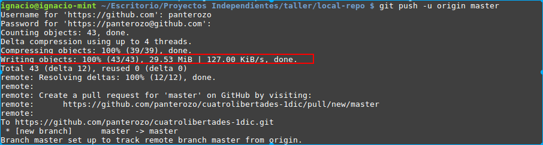

# Readme

Esta archivo cumple con la forma de escribir de MarkDown. Puedes revisar cómo se representan estos elementos en el siguiente [link](https://dillinger.io).

## Clone

Para clonar el repositorio, ejecutar el comando clone:

```
$ git clone https://github.com/panterozo/cuatrolibertades-1dic.git
```
Ya que el repositorio tiene la presentación dentro de la carpeta **OtrosRecursos/**, el repositorio nos queda con 29Mb 




## Dirígete a la carpeta OtrosRecursos/

Trabajando en el taller, el proyecto de prueba nos quedó como se indica en la imagen 


En el archivo utilidad, tenemos algunos links que de información que puede sernos de utilidad en nuestro proyecto.

## Archivo de configuración de Meld

A continuación, el archivo de configuración para utilizar meld como herramienta diff y como merge

```sh
[user]
        email = ignacio_aaa@hotmail.com
        name = Ignacio Álvarez Arenas
[core]
        editor = vim


# Se define cual será el programa para hacer los diffs
[diff]
    tool = meld
[difftool]
    prompt = false
[difftool "meld"]
    cmd = meld "$LOCAL" "$REMOTE"


# Se define cual será el programa para hacer los merge
[merge]
    tool = meld
[mergetool "meld"]
    # Choose one of these 2 lines (not both!) explained below.
    #cmd = meld "$LOCAL" "$MERGED" "$REMOTE" --output "$MERGED"
    cmd = meld "$LOCAL" "$BASE" "$REMOTE" --output "$MERGED"
[mergetool]
        keepBackup = false

```

Para incluirlo dentro de tus proyectos, ejecutar el siguiente comando:

```
$ git config --global --edit
```

Con esto, se abrirá *vim* por defecto. Debe verse como en la imagen:


Para configurar en Windows, ver el siguiente [link](https://stackoverflow.com/questions/7944757/configuring-a-diff-tool-for-git-on-windows)


## Log

El comando log que vimos en el taller es el siguiente:

```
$ git log --all --decorate --graph --oneline
```

